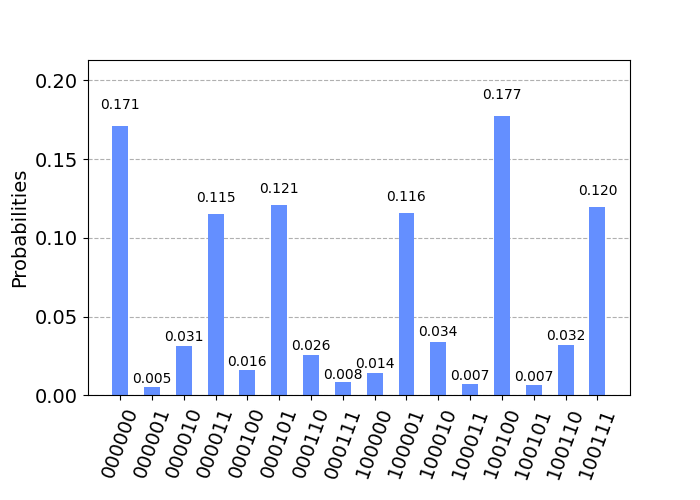
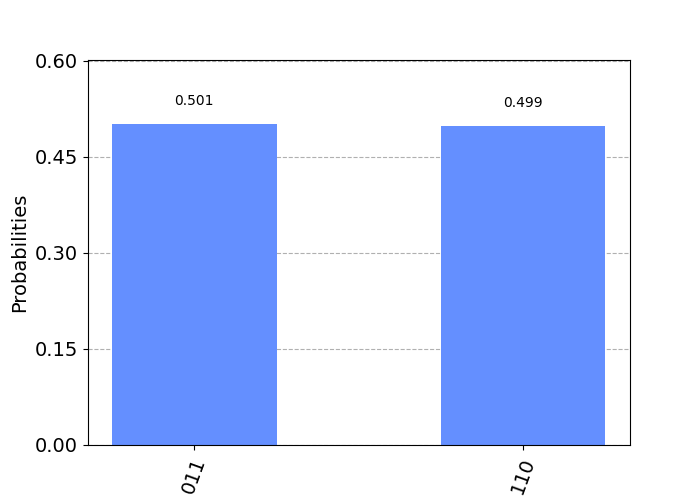

# qiskit-quantum-zoo

Implementing algorithms in Quantum Zoo with Qiskit.  
[〜Quantum Zoo やっていく〜](https://trsasasusu.com/blog/?tag=Quantum%20Zoo)

But there is only Shor's algorithm...

## Shor's factoring algorithm
  
N=8, a=3 ([Factoring（ショアの素因数分解）](https://trsasasusu.com/blog/121/q-zoo-factoring/))

## Shor's discrete log algorithm
  
N=8, alpha=3, beta=6, p=7 ([Discrete Log（離散対数問題）](https://trsasasusu.com/blog/122/q-zoo-discrete-log/))

## Grover's searching algorithm
  
N=3 ([Searching（探索問題）](https://trsasasusu.com/blog/131/q-zoo-grover/))
